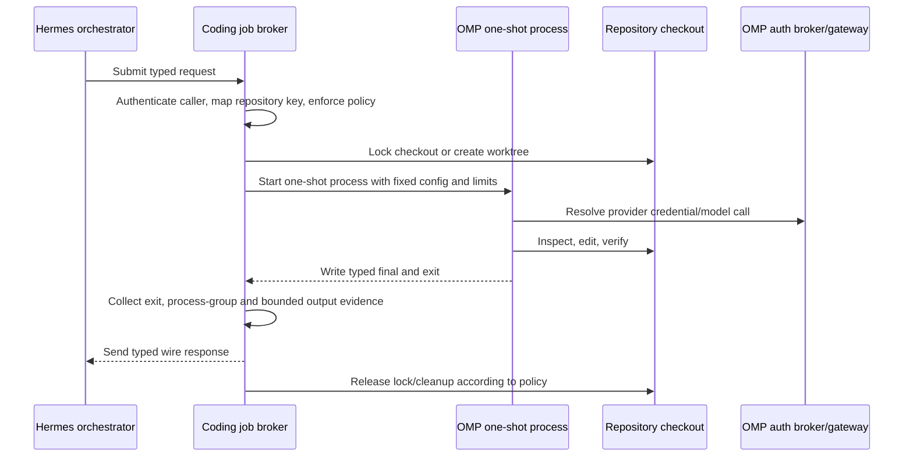

# Hermes–OMP broker specification

Connect the harnesses only after each works independently. The integration should transfer a bounded software task, not merge their identities, credentials, memories, or tool surfaces.

> **Implementation status:** this repository ships a reference implementation of this
> contract: the authenticated client/service, durable lifecycle store, restricted OMP
> extension, Hermes adapter, wire schema, service templates, and deterministic tests.
> Deployment-specific clean-install, cancellation/restart, and retained-result scenarios
> remain acceptance work for each operator.

## Required properties

A production bridge must:

- accept only server-owned repository identifiers from an allowlist;
- map identifiers to server-owned paths, model, write policy, and timeout;
- run under the OS identity that owns OMP and the approved repositories;
- keep coding-provider refresh tokens unreadable to the Hermes service identity;
- serialize jobs per shared checkout or create isolated worktrees;
- cap prompt size, runtime, output size, and concurrency;
- preserve stdout/stderr and exit status as evidence without returning secrets;
- return a typed status and verification record;
- support cancellation and clean up child processes/worktrees;
- fail closed on malformed input or output;
- never push, publish, merge, restart, or spend beyond policy without explicit authority.

The JSON Schema in [`schemas/coding-job.schema.json`](../schemas/coding-job.schema.json) defines the protocol-v1 wire request and response. Authorization belongs in the broker, not in the schema. The public request `timeout` maximum is 3600 seconds so a policy-raised ceiling can travel on the wire; the broker still applies the caller's admitted bound, default 810.

### Protocol operations

Protocol version 1 supports invoke and status operations. An invoke request has the
existing request shape in the normative schema and does not include an `op` field. The
broker discriminates the request shape before it validates the invoke fields. Adding an
`op` field to an invoke request is invalid.

A status request is one bounded frame with exactly these fields:

```json
{
  "version": 1,
  "op": "status",
  "request_id": "request-17",
  "caller": "planner",
  "repository": "example-service"
}
```

The broker admits `caller` and `repository` through server-owned policy, then reads the
durable record for `request_id`. A status request does not start OMP, mutate the job, run
orphan recovery, or add execution or audit records. The broker returns a job only when the
stored caller and repository match the request.

A successful status response has exactly this shape:

```json
{
  "version": 1,
  "op": "status",
  "ok": true,
  "job": {
    "request_id": "request-17",
    "task_id": "task-17",
    "repository": "example-service",
    "caller": "planner",
    "status": "completed",
    "result": null,
    "created_at": 1777000000,
    "updated_at": 1777000001
  }
}
```

The `job` object contains only the fields shown. In particular, it does not expose a
stored process-group identifier. `result` is either the stored invoke response or `null`.

An unknown job, an unauthorized caller or repository, and a caller or repository mismatch
produce the same response:

```json
{"version":1,"op":"status","ok":false,"error":"job unavailable"}
```

The client command `omp-invoke --status REQUEST_ID` takes caller and repository identity
from `OMP_INVOKED_BY` and `OMP_REPOSITORY`. It validates that pair against policy before it
opens the broker socket. The status path does not read a prompt or resolve a workspace or
model. Add `--json` before or after `--status REQUEST_ID` to print the job object as JSON.

## OMP integration modes

OMP exposes four useful entry points:

| Mode | Use | Tradeoff |
|---|---|---|
| `omp -p "…"` | Simple bounded one-shot job | Final prose is easiest, but event/evidence capture is less structured. |
| `omp --mode rpc --no-session` | Long-lived or isolated process controlled over NDJSON | Best general bridge: structured prompts, responses, events, aborts, and model changes. |
| Node SDK | Broker already uses TypeScript and needs direct typed events | Tightest integration, but couples the broker to OMP package APIs. |
| ACP | Editor integration | Not the default server-side job bridge. |

The shipped reference implementation uses one-shot `omp -p` plus the trusted `broker_finalize` extension and a broker-owned result file. RPC remains an alternative for a language-neutral long-lived broker; do not scrape the TUI.

## Credential architecture

### Same-host minimum

Run Hermes as a restricted service account and OMP as the operator/coding account. A local Unix socket or loopback service owned by the operator accepts typed jobs. File permissions allow Hermes to connect to that socket but not read OMP's config/auth database.

The broker validates the repository key and launches OMP. Hermes never executes `sudo -u`, reads the operator home, or receives provider tokens.

### OMP auth broker and auth gateway

OMP now ships upstream credential services:

- `omp auth-broker serve` owns the canonical SQLite credential vault and refreshes OAuth tokens.
- `omp auth-gateway serve` exposes authenticated OpenAI/Anthropic/Responses/pi-compatible model routes while resolving credentials server-side.

This closes a major part of the credential-distribution problem. Use it before inventing another token broker.

Security requirements from OMP's design:

- transport security is the operator's responsibility—use loopback, Tailscale/WireGuard, or TLS;
- every non-health endpoint uses bearer authentication;
- broker and gateway token files must remain mode `0600` in a private directory;
- do not run the gateway with `--no-auth` beyond loopback-only local testing;
- account-pool files are routing policy for trusted clients, not authorization boundaries;
- strict credential checks may consume quota;
- encrypted client snapshots improve availability but do not replace broker authorization.

Read [OMP Auth Broker and Auth Gateway](https://github.com/can1357/oh-my-pi/blob/main/docs/auth-broker-gateway.md) before deployment and run the installed subcommands' `--help`.

The auth broker protects provider credentials. It does **not** authorize repositories, Git operations, filesystem paths, or deployment actions. The coding job broker still enforces those.

## Request lifecycle



The broker—not the model—collects repository status and changed paths. A model's “tests pass” sentence is not evidence.

## Repository policy

Configure repository policy on the broker, for example:

```yaml
repositories:
  example-service:
    path: /srv/coding/example-service
    write: true
    require_clean_start: true
    require_commit: false
    allowed_roles: [default, slow, reviewer]
    max_seconds: 3600
    max_concurrency: 1
```

This is an illustrative shape, not an OMP config file. Never accept an arbitrary `path`, executable, config overlay, environment variable, or shell command in a request from Hermes.

Decide dirty-tree behavior explicitly:

- **Interactive operator task:** preserve and work with the user's changes.
- **Automated bounded task:** require a clean checkout or create an isolated worktree.
- **Review task:** read-only checkout and no apply/merge.
- **Failure:** preserve evidence; do not auto-clean an ambiguous dirty state.

## Output contract

The protocol-v1 response contains the request ID, process exit code, bounded standard output
and error, timeout flag, process-group-clear flag, and an optional typed final. The final
contains:

- the model-written summary;
- verification statements;
- explicit gaps;
- a verdict: `MET`, `PARTIALLY MET`, or `NOT MET`;
- optional `served_model` (`provider/id`) recorded by `broker_finalize` from the
  post-fallback extension context model.

A stored result without `served_model` remains valid. Client JSON output names both the
policy-requested model and the served model; a missing served model is empty so a caller
can treat it as a gap. The text format does not include those fields.

The broker persists a separate lifecycle status such as `completed`, `failed`, `cancelled`,
`timed_out`, `orphaned`, or `delivery_failed`. The Hermes adapter independently compares the
result with its before/after Git observations. A model's summary and verification strings
remain claims; neither the schema nor a `MET` verdict grants authority.

Do not return full environment dumps, credential paths, auth snapshots, private SSH configuration, or unbounded session transcripts.

## Task correlation and independent transports

The request and result carry an existing task-ledger identifier as their correlation key.
The broker does not own task status or authority.

A mailbox may carry information about the same task through an independent package. Broker
admission never depends on mailbox delivery, and mailbox text cannot grant broker authority.

Untrusted research is screened outside the privileged engineering context. A broker request
may include a bounded, sourced finding under the task's existing authority; it does not grant
OMP a new unrestricted web capability. The research caller may use only broker-owned
`backlog_search` and `backlog_fetch` adapters through fixed loopback backends. Fetch targets
must be public HTTP(S) at default ports with public DNS resolution; private, local, reserved,
credential-bearing and alternate-port URLs fail before extraction. Results are bounded,
labelled untrusted data or an explicit failure. Writer and legacy callers do not receive
those tools.

## Cancellation and recovery

The bridge must handle:

- caller disconnect;
- operator cancellation;
- OMP crash;
- broker restart;
- timeout;
- provider outage;
- dirty worktree after failure;
- result delivery failure.

Persist a small job record before launch. On restart, classify the orphan, preserve its checkout, and require an operator decision unless deterministic cleanup is proven safe. A timeout kills the process tree, not only the parent PID.

## Acceptance scenarios

1. Read-only request completes and reports zero changed paths.
2. Write request changes only allowed files and returns a passing targeted check.
3. Unknown repository key is rejected before OMP starts.
4. Supplied filesystem path/environment field is rejected by schema/policy.
5. Concurrent writes to one checkout serialize or use isolated worktrees.
6. Cancellation kills descendants and records `cancelled`.
7. Timeout records `timed_out` and preserves dirty evidence.
8. Hermes cannot read OMP credential files.
9. Broker token does not appear in result/log output.
10. A model claim that disagrees with observed Git/test evidence is reported as disagreement, not success.
